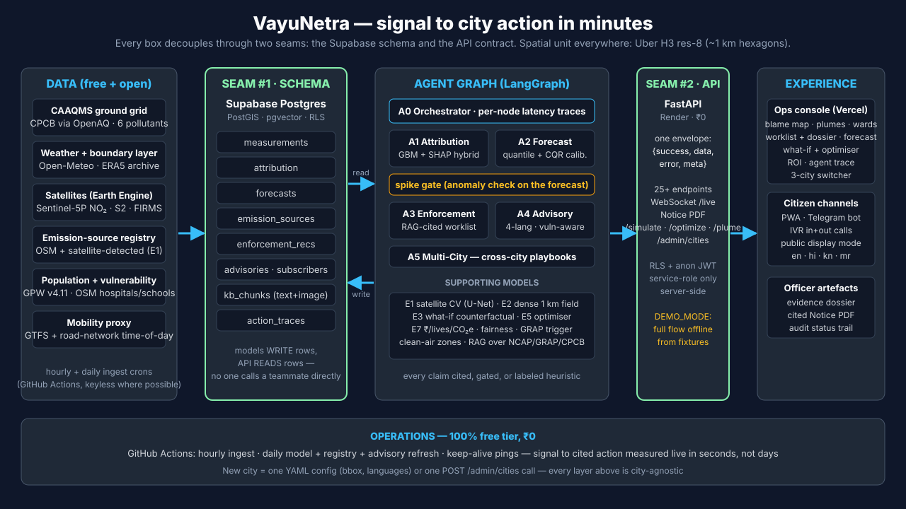

# VayuNetra — AI-Powered Urban Air Quality Intelligence

> *"We don't just measure the air. We trace it, predict it, and act on it."*
> PS5 · Economic Times AI Hackathon 2026 · City-agnostic multi-agent platform · **₹0 / free-tier**.

A multi-agent **action engine** that fuses CAAQMS ground sensors, Sentinel-5P/MODIS satellite,
mobility feeds, weather, and land use into: **source attribution → hyperlocal forecast →
enforcement intelligence → citizen advisory → multi-city comparison.**

## 🌐 Live demo
| | |
|---|---|
| **App (Vercel)** | https://vayunetra-aqi.vercel.app |
| **API (Render)** | https://vayunetra-c8i8.onrender.com/health |
| **Try it** | Click any hexagon on the blame map → that cell's full story (blame → forecast → act). *action* tab → Evidence dossier (RAG citations) → Notice PDF. *citizen* tab → advisories in 4 languages + live Telegram/IVR broadcast. |

**Live right now (2026-07-19):** 3 cities (Delhi · Bengaluru · Mumbai) · **449k+ real measurements** (OpenAQ + Open-Meteo + Sentinel-5P + GPW population) · 216 attribution cells · 105 quantile forecasts · 144 advisories in 4 languages · **390 RAG-cited enforcement recommendations** · 547 emission sources (487 CV-detected + 60 OSM registry) · real Sentinel-2 evidence patches in the top-priority dossiers (honestly-labeled markers for the rest) · signal→action latency traced end-to-end.

**E1 Satellite CV Reproducibility (Detection-Lite v0):** 
The live detector runs **heuristic detection-lite v0** via Earth Engine (NDVI drop → construction/bare soil; FIRMS thermal anomaly → waste burning). Detections write to `emission_sources(source_origin='cv_detected')` via [scripts/run_e1_inference_live.py](scripts/run_e1_inference_live.py) (restored after a cron wipe — the daily registry refresh is now scoped so restored rows persist).
*Note:* The U-Net CNN model (`e1_cv_model.pth`) is currently a CNN-in-training (trained on synthetic data in this [Kaggle Notebook](https://www.kaggle.com/code/vayu-netra/e1-satellite-cv-unet-training)); we honestly fallback to detection-lite v0 heuristics for real tiles to avoid fabricating data.

**Honest numbers** (walk-forward backtests on live data, 3 folds — regenerate via [eval/evaluate.ipynb](eval/evaluate.ipynb)):
| City | skill vs persistence (24/48/72h) | skill vs climatology (24/48/72h) |
|---|---|---|
| Delhi (n=27k) | +4% / +4% / +8% | **+31%** / +18% / +16% |
| Bengaluru | **+15%** / +17% / +9% | +14% / +5% / −7% |
| Mumbai | **+15%** / +18% / **+30%** | +3% / +3% / +4% |

*skill = 1 − RMSE_model / RMSE_baseline. We show both baselines, including the weak spots — real model, real data, no demo props.*

**Attribution cross-checked against published emission inventories** (`evaluate.ipynb §10`):
cosine similarity **0.92 vs SAFAR-Delhi (2018)** · 0.88 vs CSTEP-Bengaluru (2022) · 0.79 vs
NEERI/Urban-Emissions Mumbai — locally-attributable categories, discrepancies explained
(e.g. biomass ≈ 0 in July is seasonally correct; inventories are annual averages).
What-if intervention magnitudes are literature-grounded (Delhi odd-even trials, CAQM GRAP
schedules) — every number carries its citation in the `/simulate` response.

## 🏗 Architecture at a glance



Everything decouples through **two seams** — the Supabase schema and the API contract: models
**write rows**, the API **reads rows**, panels call **only the API**. The spatial unit everywhere
is an **Uber H3 res-8 cell (~1 km)**. Full detail: [docs/ARCHITECTURE.md](docs/ARCHITECTURE.md).

## 🧭 Where we sit in India's air-quality stack
CPCB sensors *measure* · SAFAR *forecasts* · **VayuNetra operates** (who's polluting this
cell now → 72h forecast → cited enforcement notice → citizen call, in minutes) ·
[PAVITRA](https://pavitra.org) (IIT-B/Berkeley/UW/CSTEP) *plans policy* on annual timescales.
**Roadmap:** integrate InMAP-PAVITRA source–receptor matrices to upgrade our what-if simulator
from linear-rollback screening to policy-grade emission→concentration physics — their science
is our upgrade path, not our competitor.

## 📚 Docs (read in this order)
1. [docs/PRD.md](docs/PRD.md) — product requirements (the "what" and "why")
2. [docs/ARCHITECTURE.md](docs/ARCHITECTURE.md) — buildable blueprint (the "how")
3. [docs/API_CONTRACT.md](docs/API_CONTRACT.md) — the app contract everyone codes against

## 👥 Ownership (2 agents each)
| Person | Agents | Lane |
|---|---|---|
| **Omkar** | A1 Attribution · A2 Forecast | AI/ML core (the 2 hero models) + dispersion |
| **Abhinav** | A0 Orchestrator · A3 Enforcement | multi-agent backbone + backend/platform + RAG |
| **Sejal** | A4 Advisory · A5 Multi-City | app shell + frontend + channels + mobility |

## 🚀 Quick start
```bash
# 0. Secrets
cp .env.example .env          # fill keys; keep DEMO_MODE=true to run offline first

# 1. Database (the data contract) — push migrations via the Supabase CLI
npx supabase login                                   # one-time (browser)
npx supabase link --project-ref dwqjqpohgkxekqilhotr # one-time (enter DB password)
npx supabase db push                                 # applies schema + RLS + city seed
python scripts/seed_delhi.py --push                  # synthetic Delhi measurements

# Optional live bootstrap after the live attribution/forecast tables exist
make live-bootstrap                                  # kb_chunks + enforcement_recs + action_traces

# 2. API (serves demo fixtures in DEMO_MODE — works with zero live deps)
python -m venv .venv && source .venv/bin/activate
pip install -r requirements.txt        # lean, CPU-only (no CUDA)
# need local embeddings (RAG/CLIP) or local training? add the heavy stack:
#   make install-ml   (installs CPU PyTorch + transformers — GPU training is on Colab/Kaggle)
uvicorn api.main:app --reload          # -> http://localhost:8000/health

# 3. Web (Sejal owns the app shell)
cd web && npm install && npm run dev    # -> http://localhost:5173
```

## 🗂 Repo layout (ARCHITECTURE.md §20)
```
connectors/  core/{spatial,schemas,config/cities}  ml/{attribution,forecast,dispersion,
vision,coverage,simulator,impact,anomaly}  agents/  rag/  api/  web/  channels/  eval/
demo/  supabase/migrations/  infra/workflows/  .github/workflows/  tests/  docs/
```
*Adding a city = drop a `core/config/cities/<city>.yml`. That's the scalability story in one folder.*

## 🔑 The two seams (so nobody blocks anybody)
1. **Supabase schema** ([20260627000001_init.sql](supabase/migrations/20260627000001_init.sql)) — models/agents **write** rows, UIs **read** them.
2. **API contract** ([API_CONTRACT.md](docs/API_CONTRACT.md)) — `{success, data, error, meta}` envelope.

Work against seed data + `demo/fixtures/*` until the stage-end **Integration Window**. ₹0 infra throughout.
