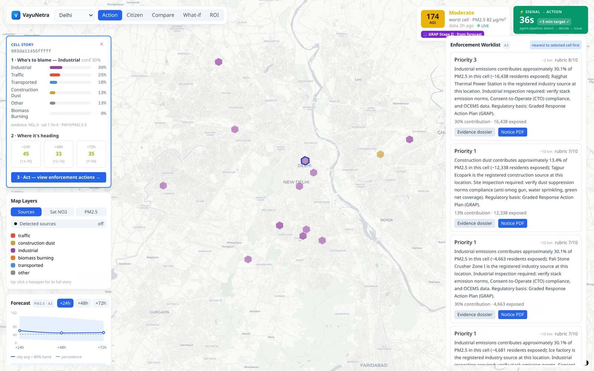

# VayuNetra — AI-Powered Urban Air Quality Intelligence

<<<<<<< HEAD
> *We don't just measure the air. We trace it, predict it, and act on it.*
> ET AI Hackathon 2026 · Problem Statement 5 · Delhi · Bengaluru · Mumbai · **₹0 infrastructure**

India measures its air (900+ CAAQMS stations) and forecasts it, but almost no city can turn a bad
reading into a specific, attributed, delivered intervention. **VayuNetra is that missing operate
layer**: a six-agent AI platform that fuses ground sensors, Sentinel satellite data, weather,
mobility and land use into one loop — *who is to blame for PM2.5 in each ~1 km² cell, what the air
will be in 72 hours, which enforcement action to take, and how to warn the people breathing it.*



## Live demo

| | |
|---|---|
| **App** | https://vayunetra-aqi.vercel.app |
| **API** | https://vayunetra-c8i8.onrender.com/health |
| **Telegram** | `@aqivayu_bot` — `/start`, pick a city, receive live advisories |

**Try it in 60 seconds:** open the console → click any hexagon (its *Cell Story*: blame →
evidence → 72 h forecast) → **Enforcement** → *Evidence dossier* (Sentinel-2 patch + RAG
citations) → *Notice PDF* (draft notice with a projected-impact chart) → **Advisories** →
switch the language to Hindi → *IVR call* tab.

## What it does

1. **Trace** — GBM + SHAP source attribution per ~1 km² H3 cell (traffic, construction dust,
   industrial, biomass burning, transported), with confidence scores — and it **abstains** to
   cited chemical-signature priors wherever the model lacks out-of-sample skill.
2. **Predict** — 24/48/72 h PM2.5 forecasts per cell with CQR-calibrated 80% uncertainty bands
   and an honest persistence baseline on every chart.
3. **Act** — a ranked, evidence-backed enforcement worklist: satellite patch + RAG-retrieved
   regulatory citations + one-click draft Notice PDF. Officer-in-the-loop; dispatching arms
   automatic before/after impact tracking.
4. **Protect** — citizen advisories in **English, Hindi, Kannada, Marathi** over the app, a live
   Telegram bot, real IVR phone calls and public displays — targeted by 2,624
   vulnerability-scored zones (hospitals, schools, outdoor workers × real population).

Plus a multi-city comparison dashboard, a cited what-if **simulator** with an inspector-hour
optimizer, a health-₹ **impact** view with a fairness audit, and a live **pipeline** trace of all
six agents (typical signal→cited-action: **0.8–9.7 s**, measured).

**Production snapshot (20 July 2026):** 3 cities · 6,394 modeled ~1 km² cells · 547 registered +
satellite-detected emission sources · 2,624 vulnerability zones · 390 RAG-cited enforcement
recommendations · advisories in 4 languages.

## Validation — real numbers, both baselines

Walk-forward backtests on live data, 3 folds — regenerate via [eval/evaluate.ipynb](eval/evaluate.ipynb):

| City | skill vs persistence (24/48/72 h) | skill vs climatology (24/48/72 h) |
|---|---|---|
| Delhi (n=27k) | +4% / +4% / +8% | **+31%** / +18% / +16% |
| Bengaluru | **+15%** / +17% / +9% | +14% / +5% / −7% |
| Mumbai | **+15%** / +18% / **+30%** | +3% / +3% / +4% |

*skill = 1 − RMSE_model / RMSE_baseline. Both baselines shown, weak spots included.*

**Attribution cross-checked against published emission inventories** (`evaluate.ipynb §10`):
cosine similarity **0.92 vs SAFAR-Delhi (2018)** · 0.88 vs CSTEP-Bengaluru (2022) · 0.79 vs
NEERI/Urban-Emissions Mumbai — with discrepancies explained (biomass ≈ 0 in July is seasonally
correct; inventories are annual averages). What-if intervention magnitudes are
literature-grounded (Delhi odd-even trials, CAQM GRAP schedules); every `/simulate` figure
carries its citation.

**Honest by construction:** the attribution abstains below its R² skill gate; forecast intervals
were audited, found under-covered, and fixed with CQR; a deep-learning forecaster (TFT) was
trained on GPU and *rejected* because LightGBM won held-out skill in all three cities; satellite
source detection currently runs a labelled Earth-Engine heuristic (NDVI drop → construction,
FIRMS thermal → waste burning) while the U-Net CV model finishes training — nothing fabricated
ever reaches production, and impact figures return `null` over invented constants.

## Architecture


Everything decouples through **two seams**: the Supabase schema (models **write** rows, the API
**reads** rows) and the API contract (one `{success, data, error, meta}` envelope). The spatial
unit everywhere is an **Uber H3 res-8 cell (~1 km²)**. Six LangGraph agents run the loop —
orchestrator → attribution → forecast → *spike gate* → enforcement → advisory, plus a multi-city
comparator — each run traced per node. Full detail: [docs/ARCHITECTURE.md](docs/ARCHITECTURE.md).

**Stack:** FastAPI (Render) · React + MapLibre + Deck.gl (Vercel) · Supabase Postgres + PostGIS +
pgvector (RLS) · LangGraph · GitHub Actions crons — all free tier. **Adding a city is one YAML
file** in [core/config/cities/](core/config/cities/) (bbox, languages) or one authenticated
`POST /admin/cities` — every layer is city-agnostic.

## Quick start

```bash
# Offline-first — the full flow runs from bundled fixtures, zero keys needed
cp .env.example .env                   # keep DEMO_MODE=true
make install                           # Python venv + web deps (CPU-only, lean)
make dev                               # FastAPI :8000 + Vite :5173 in one terminal

# Going live (optional): fill .env, then
npx supabase login && npx supabase link --project-ref <your-project-ref>
npx supabase db push                   # schema + RLS + city seed (12 migrations)
make live-bootstrap                    # kb_chunks + enforcement_recs + action_traces

make test                              # 169 backend tests
cd web && npx playwright test          # 6 e2e smoke tests
```

## Repo layout

```
connectors/   ingest: CPCB/OpenAQ, Open-Meteo, Earth Engine, OSM, population, traffic
core/         H3 utils, canonical schemas, impact & intervention math, city configs
ml/           attribution, forecast, dispersion, coverage, simulator, vision
agents/       the 6 LangGraph agents + the notice-PDF writer      rag/  retrieval corpus
api/          FastAPI (31 routes + WebSocket)                     web/  React console + landing
demo/         17 offline fixtures    supabase/migrations/  schema+RLS    eval/  validation notebook
```

## Documentation

| | |
|---|---|
| [docs/USER_GUIDE.md](docs/USER_GUIDE.md) · [PDF](docs/USER_GUIDE.pdf) | Every screen, control and option — the source of truth |
| [docs/ARCHITECTURE.md](docs/ARCHITECTURE.md) | The buildable blueprint (two seams, agents, data) |
| [docs/API_CONTRACT.md](docs/API_CONTRACT.md) | The API envelope and endpoints |
| [docs/AI_METHODOLOGY.md](docs/AI_METHODOLOGY.md) | Models, validation, fairness and guardrails |
| [docs/PRD.md](docs/PRD.md) | Product requirements |
| [docs/VayuNetra_Pitch.pptx](docs/VayuNetra_Pitch.pptx) | Presentation deck |
| [docs/DEMO_VIDEO_SCRIPT.md](docs/DEMO_VIDEO_SCRIPT.md) · [PDF](docs/DEMO_VIDEO_SCRIPT.pdf) | The 3-minute demo, beat by beat |
| [docs/EXPERT_RATING_SHEET.md](docs/EXPERT_RATING_SHEET.md) · [DOCX](docs/EXPERT_RATING_SHEET.docx) | Independent domain-expert review form |

## Team

**Omkar Kadam · Sejal Kumbhar · Abhinav Prasad** — Full-Stack AI Engineers.

Three engineers, one shared codebase — each worked across the whole stack: the ML models, the
agent graph & API, and the app & citizen channels.

## Where we sit in India's air-quality stack

CPCB/CAAQMS **measures** · SAFAR **forecasts** · **VayuNetra operates** — blame this cell now,
forecast 72 h, generate a cited notice, call the citizen — in minutes ·
[PAVITRA](https://pavitra.org)/InMAP **plans policy** on annual timescales. Integrating their
source–receptor matrices under our what-if engine is the roadmap: their science is our upgrade
path, not our competitor.
=======
> *"We don't just measure the air. We trace it, predict it, and act on it."*
> PS5 · Economic Times AI Hackathon 2026 · City-agnostic multi-agent platform · **₹0 / free-tier**.

A multi-agent **action engine** that fuses CAAQMS ground sensors, Sentinel-5P/MODIS satellite,
mobility feeds, weather, and land use into: **source attribution → hyperlocal forecast →
enforcement intelligence → citizen advisory → multi-city comparison.**

## 📚 Docs (read in this order)
1. [docs/PRD.md](docs/PRD.md) — product requirements (the "what" and "why")
2. [docs/ARCHITECTURE.md](docs/ARCHITECTURE.md) — buildable blueprint (the "how")
3. [docs/PLAN_OF_ACTION.md](docs/PLAN_OF_ACTION.md) — two-stage plan, 2 agents each
4. **Your checklist:** [Omkar](docs/TASKS_OMKAR.md) · [Abhinav](docs/TASKS_ABHINAV.md) · [Sejal](docs/TASKS_SEJAL.md)
5. [docs/API_CONTRACT.md](docs/API_CONTRACT.md) — the app contract everyone codes against

## 👥 Ownership (2 agents each)
| Person | Agents | Lane |
|---|---|---|
| **Omkar** | A1 Attribution · A2 Forecast | AI/ML core (the 2 hero models) + dispersion |
| **Abhinav** | A0 Orchestrator · A3 Enforcement | multi-agent backbone + backend/platform + RAG |
| **Sejal** | A4 Advisory · A5 Multi-City | app shell + frontend + channels + mobility |

## 🚀 Quick start
```bash
# 0. Secrets
cp .env.example .env          # fill keys; keep DEMO_MODE=true to run offline first

# 1. Database (the data contract) — push migrations via the Supabase CLI
npx supabase login                                   # one-time (browser)
npx supabase link --project-ref dwqjqpohgkxekqilhotr # one-time (enter DB password)
npx supabase db push                                 # applies schema + RLS + city seed
python scripts/seed_delhi.py --push                  # synthetic Delhi measurements

# Optional live bootstrap after the live attribution/forecast tables exist
make live-bootstrap                                  # kb_chunks + enforcement_recs + action_traces

# 2. API (serves demo fixtures in DEMO_MODE — works with zero live deps)
python -m venv .venv && source .venv/bin/activate
pip install -r requirements.txt        # lean, CPU-only (no CUDA)
# need local embeddings (RAG/CLIP) or local training? add the heavy stack:
#   make install-ml   (installs CPU PyTorch + transformers — GPU training is on Colab/Kaggle)
uvicorn api.main:app --reload          # -> http://localhost:8000/health

# 3. Web (Sejal owns the app shell)
cd web && npm install && npm run dev    # -> http://localhost:5173
```

## 🗂 Repo layout (ARCHITECTURE.md §20)
```
connectors/  core/{spatial,schemas,config/cities}  ml/{attribution,forecast,dispersion,
vision,coverage,simulator,impact,anomaly}  agents/  rag/  api/  web/  channels/  eval/
demo/  supabase/migrations/  infra/workflows/  .github/workflows/  tests/  docs/
```
*Adding a city = drop a `core/config/cities/<city>.yml`. That's the scalability story in one folder.*

## 🔑 The two seams (so nobody blocks anybody)
1. **Supabase schema** ([20260627000001_init.sql](supabase/migrations/20260627000001_init.sql)) — models/agents **write** rows, UIs **read** them.
2. **API contract** ([API_CONTRACT.md](docs/API_CONTRACT.md)) — `{success, data, error, meta}` envelope.

Work against seed data + `demo/fixtures/*` until the stage-end **Integration Window**. ₹0 infra throughout.
>>>>>>> 434ad3829631b833a9fa2a960fb5ce96ce106729
