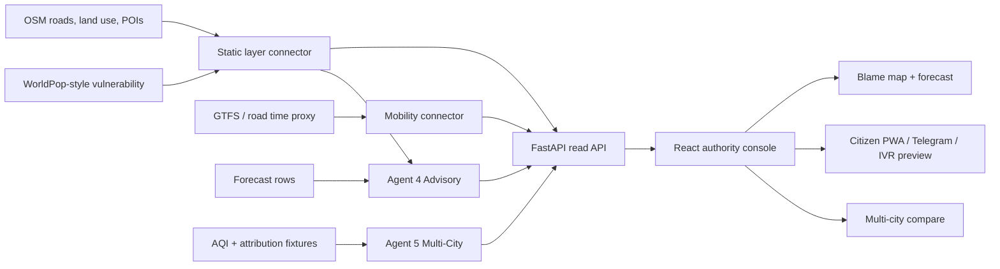

# Sejal Stage 1 Deliverables

## Architecture Diagram Draft

Concrete artifact: `docs/STAGE1_ARCHITECTURE_DIAGRAM.mmd`

## Pitch Deck Draft

Concrete artifact: `docs/STAGE1_PITCH_DECK.html`

1. Problem: cities can measure air, but cannot act fast enough.
2. VayuNetra: attribution -> forecast -> enforcement -> citizen advisory.
3. Blame map: source-colored H3 cells with confidence and evidence.
4. Forecast: +24/+48/+72h PM2.5 with persistence shown side by side.
5. Enforcement: ranked worklist with exposed population and rubric score.
6. Citizen protection: ward advisory in English, Hindi, Kannada, Marathi.
7. Multi-city proof: Delhi, Bengaluru, Mumbai switchable from one config model.
8. Mobility and vulnerability: OSM/WorldPop-style layers drive traffic and health risk.
9. Demo safety: DEMO_MODE runs fully offline from frozen fixtures.
10. Impact close: signal-to-action latency is visible and under five minutes in the demo snapshot.

## Demo Video Script Draft

Concrete recording runbook: `docs/STAGE1_DEMO_VIDEO_RUNBOOK.md`

Open on Delhi in the authority console. Switch the map from source attribution to satellite NO2 and back, then click through the forecast horizons to show the spike. Open the action tab and read the top enforcement recommendation. Switch to Citizen, change language to Hindi, and show the Telegram/IVR text. Switch to Compare, jump to Bengaluru and Mumbai, and point out that the same app shell and API contract drive all three cities. Close with the latency widget: signal to action in minutes, not weeks.
